---
tags:
  - 3D
---

# Разработка дизайна деталей для SLA 3D-печати 

!!! info
    Перевод [статьи из блога](https://ameralabs.com/blog/3d-design-parts-sla-3d-printing/) европейского производителя смол для 3D-печати - студии [AmeraLabs](https://ameralabs.com/about-us/).  
    Сделан моим отцом с целью поддержать интересное начинание. :fontawesome-solid-fish-fins:

> Многие из нас видели, как использованная нами фотополимерная смола деформируется или даже трескается через некоторое время после завершения процесса печати. Довольно часто вы можете решить эту проблему, применив правильные методы проектирования моделей. В настоящей статье мы рассмотрим ключевые элементы 3D-проектирования деталей для SLA 3D-печати. Она предназначается для опытных пользователей, которые уже знакомы с основами стереолитографической (SLA) 3D-печати и способны моделировать свои собственные детали.

Для того чтобы успешно печатать свои собственные детали, разработанные по индивидуальному заказу, вы должны изучить *основные концепции проектирования* деталей для 3D-печати. На самом деле, не существует конкретного и подробного руководства по 3D-дизайну деталей для SLA 3D-печати. Однако некоторые традиционные технологии производства уже включают в себя ряд проверенных на практике навыков и методов работы. Поэтому в данной статье мы хотели бы объединить используемые в настоящее время *технологии производства* и *опыт* **АmeraLabs** в фотополимерной 3D-печати. Мы считаем, что это поможет вам получить представление о том, как подходить к щекотливым проблемам проектирования деталей для DLP/SLA 3D-печати.

!!! info
    Настоящую статью не следует рассматривать как пошаговое руководство. Она, скорее, похожа на справочный указатель и может быть использовано по мере необходимости.

## Фотополимерная смола для SLA 3D-печати и реакция фотополимеризации

В фотополимерной 3D-печати используется фотополимерная УФ-смола, которая затвердевает под воздействием ультрафиолетового света. Это так называемое “отверждение” с технической точки зрения предполагает “сшивание” материала, когда он переходит из жидкого состояния в твердое. Данная реакция является экзотермической. Это означает, что во время процесса преобразования выделяется большое количество тепла. Иногда температура может превышать 100°C (212°F) и легко вызвать ожог вашей кожи. Более того, процесс “сшивания” вызывает нежелательную усадку, и, если ваша деталь плохо спроектирована, то это может даже привести к деформации полученной вами «распечатки» из фотополимера.

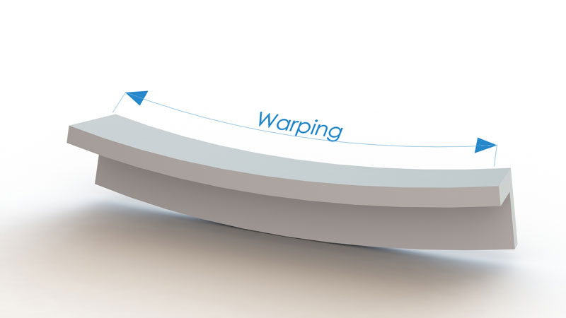

Также стоит отметить, что не вся фотополимерная смола затвердевает сразу после завершения процесса 3D-печати. Хотя у нас уже имеется монолитный объект, внутри полученной в результате 3D-печати детали все еще остается незатвердевшая фотополимерная смола. Данная не до конца отвердевшая смола продолжает затвердевать в присутствии УФ-света, существующего повсюду вокруг нас. Продолжающееся отверждение все еще может вызывать трещины и деформацию, риски появления которых можно снизить за счет использования надлежащих методов 3D-печати на фотополимерной смоле.  

Итак, давайте обсудим некоторые ключевые конструкционные решения, которые помогут вам преодолеть эти трудности.

## Стенки

### Толщина стенки

Хорошо известно, что практически невозможно печатать большие, монолитные, не пустотелые объекты на фотополимерных 3D-принтерах. **Чем толще стенка, тем больше нагрузка** на ваш объект, получаемый с помощью 3D-печати. Эта нагрузка, в конечном итоге, приведет к появлению **крупных трещин на поверхности и внутри** объекта. Кроме того, в случае использования SLA 3D-принтера с ориентацией "снизу-вверх" и ванночкой для фотополимера в комплекте с FEP/PDMS пленкой, большая площадь поперечного сечения также приводит к возникновению **значительных сил, обеспечивающих отделение** слоя от FEP или PDMS пленки.

Поэтому **предпочтение отдается пустотелым объектам с довольно тонкими стенками**. К тому же более тонкие детали *меньше весят*, и для печати каждого такого объекта на 3D-принтере *расходуется меньше фотополимерной смолы*. Это становится очень важным для SLA 3D-печатных устройств с ориентацией «снизу вверх», в которых объект висит вверх ногами и постоянно подвергается воздействию сил притяжения. В среднем, **толщина стенок должна составлять от 1 мм до 2 мм (0,080-0,160 дюйма)**. Можно пойти на использование немного более толстых стенок, но это должно быть согласовано с проектным решением в целом. Вам также следует выбирать подходящую для 3D-печати фотополимерную смолу с низкой степенью усадки. Вы можете использовать и более тонкие стенки, но при удалении опор повышенная хрупкость может вызвать проблемы.

### Одинаковые стенки

Мы настоятельно рекомендуем **сохранять ваши стенки плотными и одинаковыми (по толщине)**. Если стенки объекта, напечатанного на DLP 3D-принтере, являются не одинаковыми по толщине, то **усадка секций с узкими стенками**, которые состоят из меньшего количества материала, **будет менее выраженной**. Усадка таких узких сегментов также завершится быстрее по сравнению с более толстыми, на которые ушло больше материала. По мере завершения усадки толстостенных секций **происходит деформация** полученного из фотополимера объекта, которая в конечном итоге приводит к возникновению **трещин**, потому что усадка сегментов с более узкими стенками уже была завершена ранее.

### Что делать в том случае, если вы не можете получить одинаковые стенки в силу проектных ограничений?

Порой невозможно получить стенки одинаковой толщины. В таких случаях **изменение толщины стенок** должно быть настолько **единообразным**, насколько это возможно. Следую данному принципу, интенсивность нагрузки и риск появления возможных трещин будут снижены. На приводимом ниже рисунке показано, как простая формула может быть использована для расчета изменения толщины стенок. 

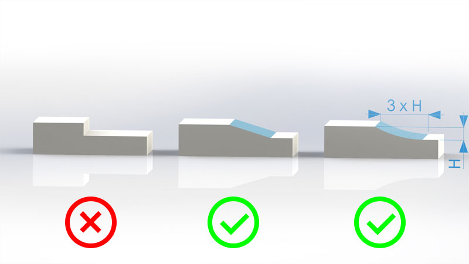

## Приливы

Наиболее распространенным **назначением приливов** в процессе проектирования является выполнение вспомогательных функций при **соединении** деталей. Обычно мы используем их для присоединения таких крепежных изделий как винты. Тем не менее, мы настоятельно рекомендуем в отдельном порядке производить печать **пробных деталей** с вашими размерами диаметров под резьбу и смотреть, что из этого выходит до того, как *спроектированный объект будет распечатан целиком*. Дело в том, что материалы для фотополимерной 3D-печати в итоге оказываются довольно хрупкими, и нарезать резьбу становится все сложнее. Обычно любые усилия по нарезанию резьбы приводят к появлению трещин и повреждению деталей. Поэтому, печатая пробные детали и экспериментируя, вы можете избежать проблем при создании резьбового соединения для последней детали. Ниже мы приводим **рекомендации по конструкции прилива**.

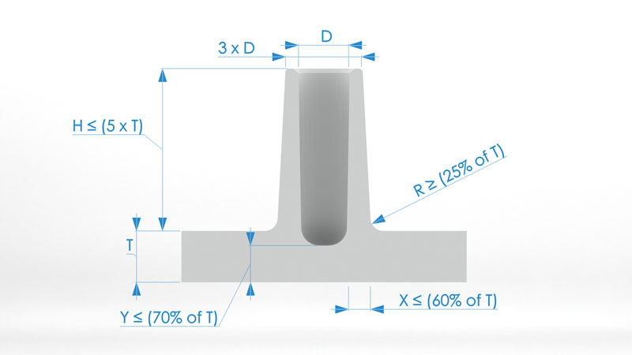

## Ребра

Ребра используются, главным образом, для усиления прочности на изгиб у спроектированной детали без какого-либо дополнительного увеличения толщины. Ребра повышают осевой момент инерции сечения, который усиливает прочность на изгиб и снижает степень деформации детали, полученной в результате фотополимерной печати.
```
Прочность на изгиб = E  x I 
E - Модуль Юнга
I - Осевой момент инерции сечения
```
**Толщина ребер должна быть меньше толщины стенок** в целях минимизации риска возникновения возможных трещин и дополнительных удельных нагрузок после 3D-печати и в ходе доотверждения.  Мы рекомендуем стремиться к толщине ребер **на уровне 60% от толщины стенок**. Также важно, чтобы радиус скругления угла стыкуемого ребра был как можно более плавным. Уклон (более широкое основание) для ребра не является обязательным, но в некоторых случаях может быть полезно уменьшить угол, под которым ребро печатается в 3D. Это может помочь **уменьшить потребность в дополнительных опорах**. См. рекомендации по проектированию ребер на приводимом ниже изображении.

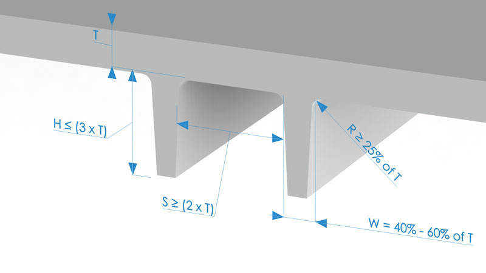

Кроме того, есть еще один важный аспект, который следует учитывать, если у вас есть деталь с пересекающимися ребрами. Такие пересекающиеся области будут иметь большую толщину и, следовательно, состоять из большего количества материала. Вы можете легко удалить излишки материала, просто сделав полым место пересечения ребер для сохранения равномерными толщины стенок и объема материала.

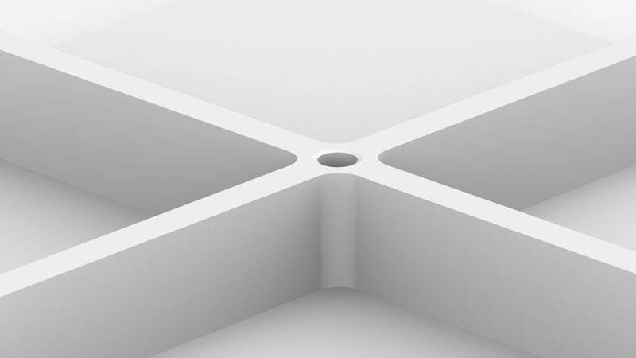

## Угловые крепления

Использование так называемых **угловых креплений** является еще одним способом *усиления прочности объектов, созданных методом 3D-печати*. Такие крепления представляют собой опорные элементы, конструируемые **для сведения к минимуму деформацию детали**. В большинстве случаев, угловые крепления можно рассматривать как разновидность ребер, при этом рекомендации по проектированию ребер применимы также и для угловых креплений.  

Если угловое крепление стыкуется с приливом, то его **высота может достигать 95% высоты такого прилива**. Однако его высота должна быть **в 4 раза меньше номинальной толщины стенок**, а предпочтительная высота равняться **номинальной толщине стенки, помноженной на 2**. Что касается длины углового крепления, то она может варьировать в пределах от **30% до 100% высоты** углового крепления.

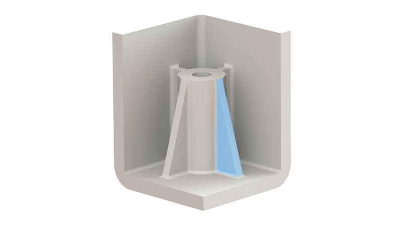

## Острые углы

Довольно **острые углы** могут значительно **увеличить концентрацию напряжений** для ваших деталей, напечатанных на фотополимерном 3D-принтере. Это напряжение может привести к заметным трещинам и, в исключительных случаях, к полному разрушению детали, полученной в результате 3D-печати. Необходимо тщательно следить за радиусом острых углов, поскольку **концентрация напряжений изменяется в зависимости от радиуса для заданной толщины**.

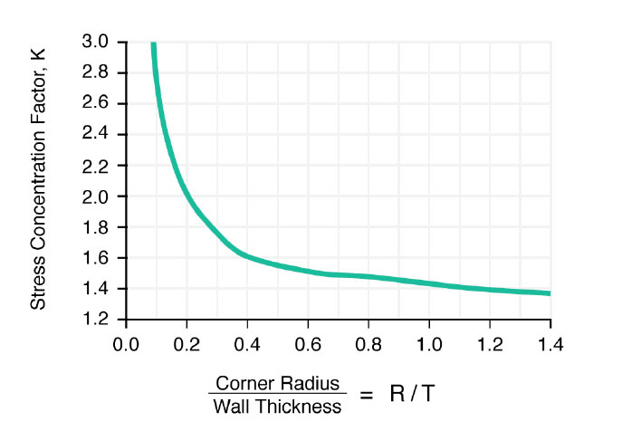

Как видно из диаграммы, **коэффициент концентрации напряжений получается высоким для значений R/T** (Радиус/Толщина) **менее 0,5**, однако при значениях концентрации R/T более 0,5 он снижается. Коэффициент концентрации напряжений является множителем, который заметно повышает напряжение. Поэтому мы настоятельно рекомендуем делать величину внутреннего радиуса равной как минимум толщине стенки.  

Что касается углов, то рекомендуемый **внутренний радиус составляет 0,5 толщины материала, а внешний радиус – 1,5 толщины материала**. Если проектное решение для вашей детали, которая будет напечатана на 3D-принтере, позволяет это, то настоятельно рекомендуется использовать увеличенный радиус.

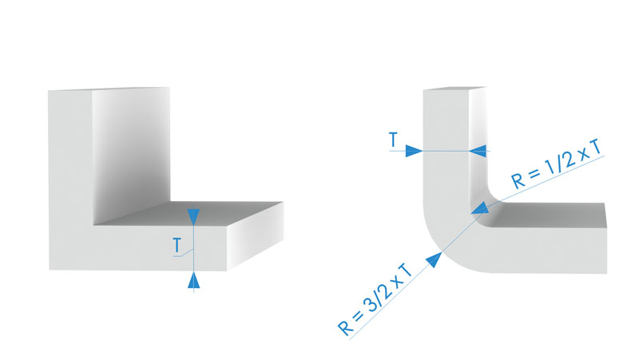

## Пример проекта

Мы хотели бы продемонстрировать, *как правильные методы проектирования могут повлиять на ваши результаты фотополимерной 3D-печати*. Для этого мы проведем эксперимент по 3D-печати **корпуса для печатной платы**.
Чтобы лучше проиллюстрировать влияние конструктивного решения на успех 3D-печати, мы сделали **два 3D-дизайна** для одного и того же лотка: один без учета рекомендаций касательно проекта, а второй - с реализованными проектными рекомендациями.


### Ключевые элементы 3D-дизайна

- Размер лотков: **90x50x16,5 мм**
- В проекте *с соблюдением рекомендаций* толщина всех стенок была **одинаковой** и составляла 1,5 мм.
- В проекте *без учета рекомендаций* стенки также были толщиной 1,5 мм, поскольку мы полагали, что окончательное решение могло бы оказаться слишком неоднозначным, если размер толщины стенок сильно бы варьировал. Высота стенок в обоих проектах составляла 15 мм.

- В проекте *с соблюдением рекомендаций* имелись сегменты с **более толстыми стенками**, при этом проектировалось их **плавное превращение в более тонкие стенки**.
- В проекте *без учета рекомендаций* также присутствовали **более толстые стенки**, однако **плавные «переходы»** не создавались.

- В проекте *с соблюдением рекомендаций* **использовались ребра** для усиления нижней части лотка, а также в целях уменьшения деформации и усадки объекта фотополимерной печати. Ребра были в два раза выше по сравнению с толщиной стенки. Участки примыкания ребер к стенкам были скруглены для снижения напряжения.
- В проекте *без учета рекомендаций* **ребра вообще не использовались**.

- В проекте *с соблюдением рекомендаций* также **использовались угловые крепления** для дальнейшего повышения предела прочности стенок, поскольку лоток будет формироваться на 3D-принтере под углом. Размеры угловых креплений: основание - 3 мм, высота - 10 мм и толщина – 0,9 мм.
- В проекте *без учета рекомендаций* **угловые крепления вообще не использовались**.

- В проекте *с соблюдением рекомендаций* все острые углы были скруглены согласно рекомендациям, которые мы представили в предшествующем разделе. Внутренний радиус для закругления всех углов равнялся 0,75 мм, а для всех внешних скруглений – 2,25 мм.
- В *проекте без учета рекомендаций* использовались **острые углы**.

- В проекте *с соблюдением рекомендаций* имелись отверстия **для резьбового соединения, сделанные с целью отграничения приливов**, при этом объект был **усилен за счет угловых креплений и ребер**. Высота ребер равнялась высоте прилива, их толщина составляла 0,9 мм, а размеры угловых креплений были такими же как у их аналогов для стенок.
- В проекте *без учета рекомендаций* **отверстия для резьбового соединения были размещены в стенках**.

### Параметры 3D-печати

- DLP 3D-принтер с проектором `Acer H6510BD` (сходный с `Kudo 3D` `Titan 1` и `Titan 2`).
- Нормальное время засветки на один слой – **4 секунды**.
- Время засветки нижних слоев – **50 секунд**.
- Разрешение по XY – **55 мкм**.
- Высота слоя – **100 мкм**.
- Стандартная скорость подъема слоев – **40 мм/мин**.
- Скорость перемещения нижних слоев – **10 мм/мин**.
- Все лотки проходили стадию доотверждения, оставаясь на рабочей платформе с опорами в течение **2 часов**. После демонтажа опор проводилось дополнительное доотверждение на протяжении **1 часа**.
- Использовалась специальная комбинированная смола от AmeraLabs.

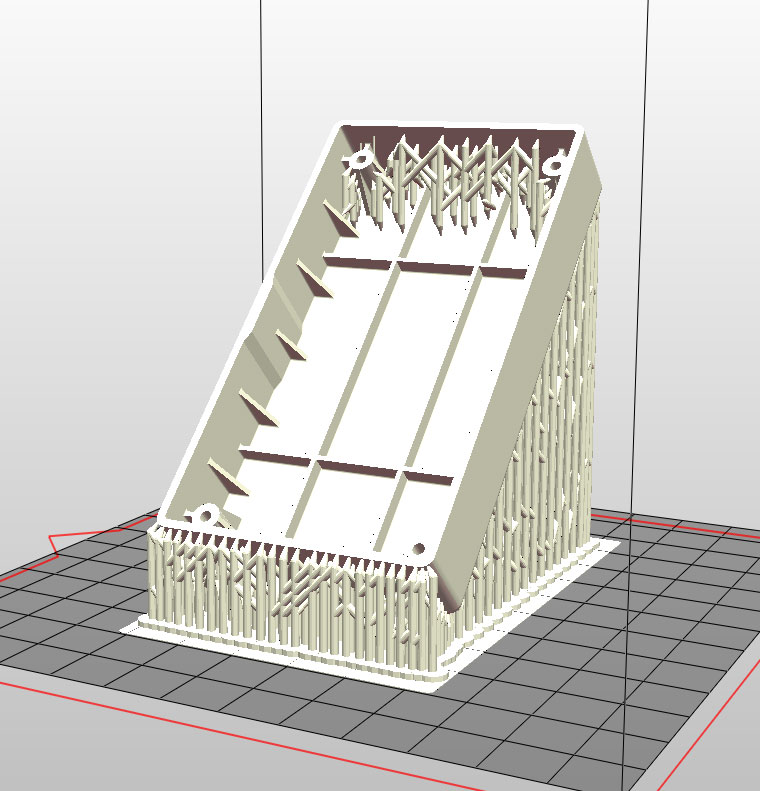

Важно отметить, что значительная **деформация** при SLA 3D-печати фактически **происходит во время процесса 3D-печати**. В установках с ориентацией "снизу вверх" как, например, Anycubic Photon, Wanhao D7, Peopoly Moai или в большинстве DIY SLA 3D-принтерах, которые используют пленки FEP из PDMS в лотках для смолы, **разделение отвержденного слоя создает большую нагрузку на деталь**. Конечный результат в значительной степени зависит от **надлежащих методов создания опор**, которые необходимо использовать **для уменьшения деформации создаваемой из смолы детали** во время 3D-печати. После того, как вы успешно справитесь с процессом 3D-печати, наступает очередь правильной реализации проектного решения. Она поможет сохранить структуру и форму объекта на длительную перспективу с учетом воздействия УФ-света в окружающей среде.  

После того, как мы распечатали и очистили все детали, а также произвели их дополнительное отверждение, мы размещаем их **на внешней поверхности подоконника**. Мы производили обследование окончательных результатов через **две недели**. Для того, чтобы вы могли вынести свое решение и дать свою оценку, ниже представлены два изображения.

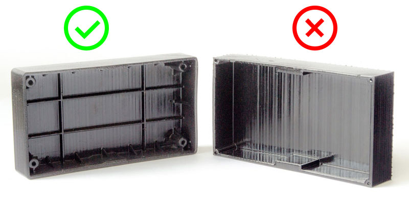

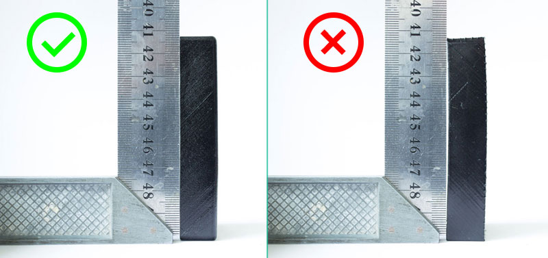

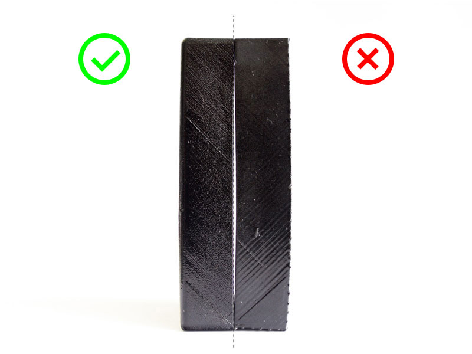

После такого тщательного рассмотрения случаев из практики стало совершенно очевидно, что **методические указания по проектированию помогли получить более предпочтительные результаты**. В случае использования данных рекомендаций мы наблюдали меньшую деформацию деталей, полученных в результате печати объектов из смолы. Более того, даже спустя две недели распечатанным объектам удалось **сохранить почти ровные поверхности**. С другой стороны, хотя мы не видели трещин на детали, полученной в рамках 3D-проекта, который реализовывался без учета рекомендаций, конечный результат пострадал от более заметной деформации и искажений. Поскольку оба объекта невелики по размерам, различия могут показаться сложными для понимания, но так как мы все хотим быть максимально точными при SLA 3D-печати, в данном случае значение имеет буквально все.

## Что же дальше?

Мы надеемся, что вы усвоили некоторые ключевые принципы, необходимые для создания функциональных прототипов. А теперь – беритесь за работу и применяйте их на практике!

[Смолы AmeraLabs](https://ameralabs.com/category/engineering-resin/)


*[SLA]: Stereolithography