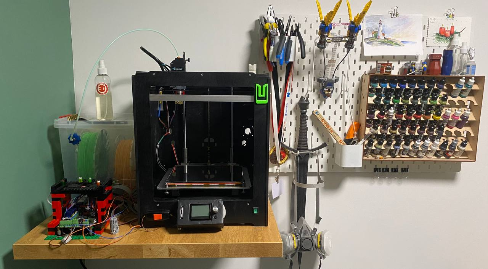

---
tags:
    - 3D
    - Marlin
---

# R2D2 Modifications Log

## Marlin Configuration

> Heisenberg_0.0.1

- [Ultimaker 2 Marlin example](https://github.com/Ultimaker/Ultimaker2Marlin)

## Configuration.h

#### @section info
    - STRING_CONFIG_H_AUTHOR "lejbron"
    - SHOW_CUSTOM_BOOTSCREEN

#### @section machine
    - MOTHERBOARD BOARD_MKS_GEN_13
    - BAUDRATE 25000
    - CUSTOM_MACHINE_NAME "melty"

- [MKS GEN 1.4 pins](https://raw.githubusercontent.com/makerbase-mks/MKS-GEN/master/hardware/MKS%20GEN%20V1.4_004/MKS%20GEN%20V1.4_004%20PIN.pdf)
- [MKS GEN 1.4 GitHub repo](https://github.com/makerbase-mks/MKS-GEN)

##### @section extruder
    - EXTRUDERS 1
    - DEFAULT_NOMIANL_FILAMENT_DIA 1.75

##### @section temperature
    - TEMP_SENSOR_0 1
    - TEMP_SENSOR_BED 1 
    - PIDTEMP
    - PIDTEMPBED
    - EXTRUDE_MINTEMP
    - TEMP_HYSTERESIS 5
    - HEATER_0_MAXTEMP 310
    - HOTEND_OVERSHOOT 10

- [Генератор таблицы термитсора для Marlin](https://www.thingiverse.com/thing:103668/files)

##### @section homing
    - USE_XMIN_PLUG
    - USE_YMAX_PLUG
    - USE_ZMAX_PLUG
    - ENDSTOPPULLUPS
    - X_MIN_ENDSTOP_INVERTING true 
    
- Stepper Drivers:
    + A4988
    + 'TMC2209' - UART connection
    + 'TMC2209_STANDALONE' - simple connection
    + [Расчет опорного напряжения для драйверов шаговых двигателей - форум 3deshnik](https://3deshnik.ru/forum/viewtopic.php?f=5&t=78)

#### @section calibrate
    - comment out: MANUAL_PROBE_START_Z
    - GRID_MAX_POINTS_X 4

##### @section motion
    - DEFAULT_AXIS_STEPS_PER_UNIT   { 80, 80, 400, 95 }
    - DEFAULT_MAX_FEEDRATE          { 300, 300, 5, 25 }
    - DEFAULT_MAX_ACCELERATION      { 3000, 3000, 250, 10000 }
    
    - P - DEFAULT_ACCELERATION          3000    // X, Y, Z and E acceleration for printing moves 
    - R - DEFAULT_RETRACT_ACCELERATION  3000    // E acceleration for retracts
    - T - DEFAULT_TRAVEL_ACCELERATION   3000    // X, Y, Z acceleration for travel (non printing) moves

    - CLASSIC_JERK
    - DEFAULT_EJERK
    - JUNCTION_DEVIATION_MM

- [Расчет Junction Deviation для Marlin](https://blog.kyneticcnc.com/2018/10/computing-junction-deviation-for-marlin.html)
- [Калькулятор расчета шаг/мм для шаговых двигателей](https://blog.prusaprinters.org/calculator_3416/#stepspermmbelt)

##### MIX
    - INVERT_X_DIR true
    - INVERT_Y_DIR false
    - INVERT_Z_DIR true
    - INVERT_E0_DIR true
    - X_HOME_DIR -1
    - Y_HOME_DIR 1
    - Z_HOME_DIR 1
    - X_BED_SIZE 195
    - Y_BED_SIZE 195
    - Z_MAX_POS 209
    - MIN_SOFTWARE_ENDSTOP_X
    - MAX_SOFTWARE_ENDSTOP_Y
    - MAX_SOFTWARE_ENDSTOP_Z

##### @section calibrate:
    - MESH_BED_LEVELING
    - LCD_BED_LEVELING
    - LEVEL_BED_CORNERS

##### @section extras:
    - EEPROM_SETTINGS

##### @section lcd:
    - LCD_LANGUAGE en
    - DISPLAY_CHARSET_HD44780 CYRILLIC
    - SDSUPPORT
    - MINIPANEL
    - MKS_MINI_12864
    
## Configuration_adv.h

- `E0_AUTO_FAN_PIN 10`
- `QUICK_HOME` 
- `BABYSTEPPING`
- `LIN_ADVANCE`
    + `LIN_ADVANCE_K 0`
    + `LA_DEBUG`
- `NO_VOLUMETRICS`
